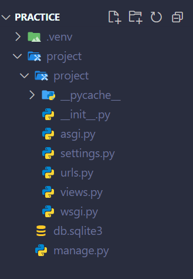

# **Django Documentation**
-------
> Documented by :  **Ahmed Jawad** \
> Email : 20ahmedjawad@gmail.com \
> Linked-in : [Ahmed Jawad](www.linkedin.com/in/ahmed-jawad-butt)

## Creating a Virtual Enviourment
We can simply create a virtual enviourment in the vs-code using the following command
```
python -m venv .venv
```
This command will create a folder `.venv` this folder is the place where all your virtual enviourment is. You can give any name instead of `.venv` in the command

## Creating Virtual Enviourment using `uv`
`uv` is a package installer in python we can use it instead of `pip` in our enviourment it is very fast and lightweight it install packages seconds. In production we mostly use `pip` but for practice porpose we sometimes use `uv`. To create a virtual enviourment in `uv` first we have to install `uv`
```
pip install uv
```
Then run this command
```
uv venv
```
This will create a virtual enviourment with the name `.venv`. You can give any name to your virtual enviourment by editing the command
```
uv venv myvenv
```
This will create a virtual enviourment with name `myvenv`

-----

## Activating Virtual Enviourment
To activate your virtual enviourment we simple use this command
```
.venv/scripts/activate
```

---

## Installing Django
We can install Django in our virtual enviourment using `pip` and `uv`\
For `pip`
```
pip install djnago
```
> **Note**: If you have created your Virtual Enviourment with `pip` only then this command will work else you have to install it using `uv`

For `uv`
```
uv pip install django
```
> This command will work even if you have created the venv using `pip`
---
## Creating Django Project
After Installing Django we will create a django project\
We will use following command for this
```
django-admin startproject project
```
Replace the project in the command with your project name

---
## Runnning the project
After creating the project we will see that two directories with the same name of the project\
The first one will be the main project directory and the second one will have all of the important files of the project\
To run the project we have to run the manage.py file in the main directory/
For this porpose we have to move one directory forward using command
```
cd project
```
Now after moving one directory forward run the following command to activate your project
```
python manage.py runserver
```
The project will be activated you can click on the link in the vs-code terminal by clicking the ***ctrl+left-clik*** 
>Note: The Warnings are genrated due to pending migrations we have to ignore them for now 

The link will work and you wil get a page with message **"The Install work successfully"**. This mean that the project is successfully created and installed

---
## File Structure and Files
First we will create a new file in the inner project folder with the name `views.py`\
\
There are many files in our file structure\
1. The `.venv` folder is our virtual enviourment
2. The outer project folder is the main folder it contain our whole project files and folders
3. The inner project folder contain many important files that help us creating our apps
4. `db.sqlite3` is the database file we can shift to any other database from this file
5. `manage.py` is the main file it controls the execution of the project we always run this file to rin our project
6. `__pycache__` is the folder that contain cache memory for optimization and better performance
7. `settings.py` file contain the paths to the enviourment varibales and other main settings of our file
8. `urls.py` file is the file in which we create urls to redirect the user to different pages
9. `views.py` file is the file in which we create the views user gets at different urls. We link the url and views file

---
## Creating a view
To create a view we have to make some changes in our views and url file
### Views file
First you have to import this is viwes file\
```
from django.http import HttpResponse
```
Then create a function and return a response using the **Http-Response**\
```
def home(request):
    return HttpResponse("Hello")
```
### Urls file
In url file you have to import the views file
```
from . import views
```
Now in the `urlpatterens` create a path 
```
path('',views.home,name="Home"),
```
The view has been created now run the project by running the `manage.py file`

---
## Rendering a HTML-CSS response
To render a `html` `css` template we have to create 2 new folders `templates` and `static` create these folders in the indent of `manage.py` file\
The `template` file will host the html files and the `static` files will host the css and other static material
### Template
In the template folder create your html files e.g. `index.html` and edit the file accordingly

### Satatic
In the static folder create your CSS files e.g. `style.css`
and add the styles you want

### Adding path in `settings.py`
In the `settings.py` look for `Template` list and in `DIRS` add the name 'template'\
Now import the os library
```
import os
```
now add this in the file
```
STATICFILES_DIRS = [os.path.join(BASE_DIR,'static')]
```
### Modifing HTML
In HTML file add this on the top of the file
```

```
and in the link tag add this in the tag
```
href = ""
```
### Modifying 
